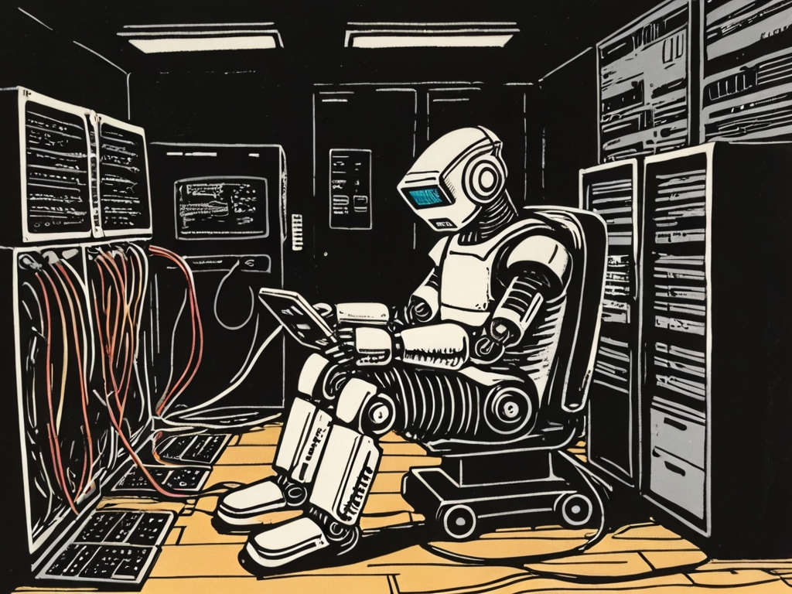
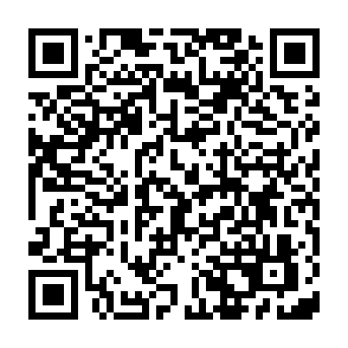

<!-- _paginate: skip -->
<!-- _class: title -->
# Introduction

## Scan me

## Why should I learn to program?

* Own developing experience
* Writing **small** programs
* Have fun!
* A lot of interaction
* Implement your ideas

## What do I learn?

* Logical thinking
* Foreign Language
* Digital Know How
* Thinking like a programmer

## Why?

<video controls height="400px">
  <source src="https://contentful-videos.code.org/90t6bu6vlf76/7rqfxtd1mTrp2cBtkkbTHt/138f45d2b821d23f5819670d2e4c8c45/videoplayback__10_.mp4" />
</video>

[Computer Science is changing everything](https://contentful-videos.code.org/90t6bu6vlf76/7rqfxtd1mTrp2cBtkkbTHt/138f45d2b821d23f5819670d2e4c8c45/videoplayback__10_.mp4)

---

[Source](https://www.bitkom.org/sites/main/files/2023-12/231213bitkom-chartsit-fachkraeftefinal.pdf)

---

[Source](https://bitkom-research.de/news/deutschland-fehlen-weiterhin-mehr-als-100000-it-fachkraefte)

## Why for Startups?
<!-- _class: dark quote -->
> 8 von 10 Startups wollen neue Mitarbeiterinnen und Mitarbeiter einstellen.
[Bitkom, 2024](https://www.bitkom.org/print/pdf/node/21708)

## How?

| Goals | Anti Patterns |
| --- | --- |
| + Consistent team Size | - Only one of the team works |
| + Pair Programming | - Devastating Critics |
| + Problem Solving | - Too Much Procrastination |

## Pair Programming

* One keyboard, two programmers

* Driver enters code
* Driver cares about the details

* Navigator is responsible for the big picture

* Constant change of roles (5-10 minutes)

---

## Evalution with three parts

1) Project documentation
1) Python Program
1) Scratch Program

## Teams

* Teams of 6 students
* Each team all 3 parts
* Communication via MS Teams
* Submission via Mail and MS Teams

---

<video controls height="400px">
  <source src="https://contentful-videos.code.org/90t6bu6vlf76/5O0hC2nclSmquSueZLcgT5/bfea2005984c2b520dfba0ec1276e878/videoplayback__12_.mp4" />
</video>

[Create with computer science](https://contentful-videos.code.org/90t6bu6vlf76/5O0hC2nclSmquSueZLcgT5/bfea2005984c2b520dfba0ec1276e878/videoplayback__12_.mp4)

## Megatrends

> Sie sind die größten Treiber des Wandels in **Wirtschaft und Gesellschaft** und prägen unsere Zukunft – nicht nur kurzfristig, sondern auf mittlere bis lange Sicht. Megatrends entfalten ihre Dynamik über Jahrzehnte.

[Source](https://www.zukunftsinstitut.de/zukunftsthemen/die-megatrend-map)

---

<!-- _footer: "" -->

[Source](https://www.zukunftsinstitut.de/hubfs/Megatrend-Map_2021-1.png)

## And... Action!

Form a team.

Choose one of the two Mega Trends:

* [Neo-Ökologie](https://www.zukunftsinstitut.de/zukunftsthemen/megatrend-neo-oekologie)
* [Wissenskultur](https://www.zukunftsinstitut.de/zukunftsthemen/megatrend-wissenskultur)

Read the corresponding article.

Then choose one of the subtrends (e.g. Lifelong Learning)
