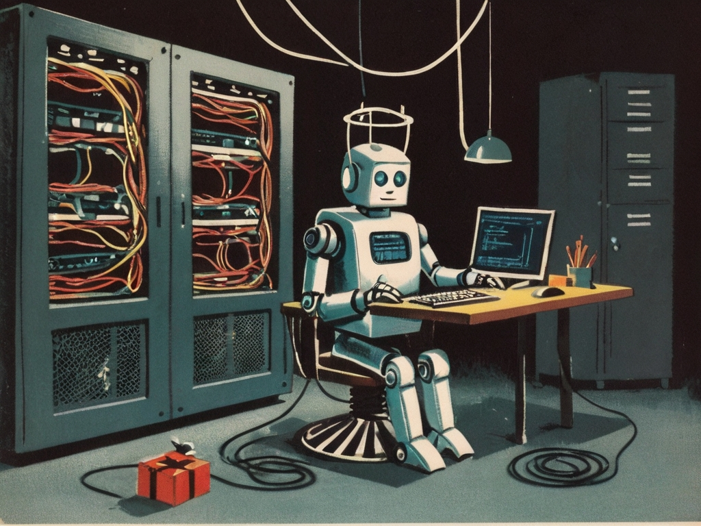

<!-- _paginate: skip -->
<!-- _class: gaia lead -->
# Scratch 
## Intro

# What?
Scratch is a visual programming environment similar to code.org.

# Strengths
* Viusally appealing programs
* Short development time
* Low barrier for entry
* Low system requirements
* Big media library
* All public projects are remixable

# Limits
* Only single user
* No versioning
* Project is either private or public
* No connections to other systems
* No debugging tools
* All projects look similar

# Practice

[scratch.mit.edu](https://scratch.mit.edu)
* Demo: Overview of all elements
* Demo: Draw a pattern
* Exercise: Create a program for the "[Haus vom Nicolaus](https://youtu.be/WuEk9FFT2Ms)".

# Details for the exercise
* Change backdrop to "Slopes" and sprite to "Reindeer"
* Draw the "Haus vom Nicolaus" with a base size of 100
  1. Position and orient the sprite
  2. Blank the screen and pen down  
  3. Draw using steps or coordinates
* Animate the drawing (use wait)
* Save to Cloud and personal drive
* Get creative (Colors, Sizes, Stamp, ...)

# To prepare
* Create an account on
  * replit.com
  * scratch.mit.edu
* Choose a team name
* Setup infrastructure
  * File share
  * Communication
  * Structure of Documentation
