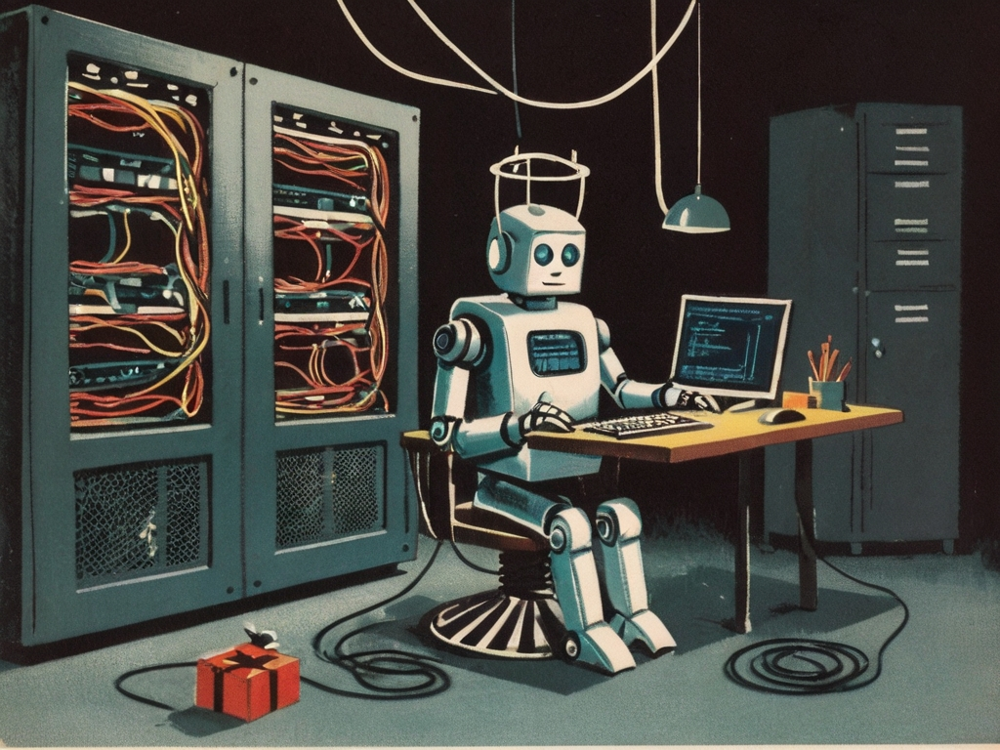

<!-- _paginate: skip -->
<!-- _class: title -->
# Scratch-Einführung

---
<!-- _class: quote dark -->
> Scratch ist eine visuelle Programmierumgebung, ähnlich wie code.org.

<!--
Speaker notes:
Der Vergleich mit code.org hilft allen, die die Hour of Code kennen.
-->
## Stärken

* Visuell ansprechende Programme
* Kurze Entwicklungszeit
* Niedrige Einstiegshürde
* Geringe Systemanforderungen
* Große Medienbibliothek
* Alle öffentlichen Projekte sind remixbar

<!--
Speaker notes:
Remixbar bedeutet: Sie dürfen jedes öffentliche Projekt kopieren und verändern.
-->

## Grenzen

* Nur einzelne Nutzerinnen und Nutzer
* Keine Versionierung
* Projekte sind entweder privat oder öffentlich
* Keine Anbindung an andere Systeme
* Keine Debugging-Werkzeuge
* Alle Projekte sehen ähnlich aus

<!--
Speaker notes:
Diese Grenzen sind genau die Punkte, die Python später löst – deshalb folgen im Kurs beide Werkzeuge aufeinander.
-->

## Warum Scratch für BMP?

> Scratch ist ein Prototyping-Werkzeug: Ideen schnell ausprobieren, bevor teure Software gebaut wird.

<!--
Speaker notes:
In Unternehmen werden Prototypen genau so genutzt – aus dem Scratch-Entwurf wird später das echte Python-Programm.
-->

## Praxis

[scratch.mit.edu](https://scratch.mit.edu)

* Demo: Überblick über alle Elemente
* Demo: Ein Muster zeichnen
* Übung: Programm für das „[Haus vom Nikolaus](https://youtu.be/WuEk9FFT2Ms)"

<!--
Speaker notes:
Live: Erst die Elemente zeigen, dann gemeinsam das Muster zeichnen, dann die Übung starten.
-->

## Details zur Übung

* Bühne auf „Slopes", Figur auf „Reindeer"
* Das Haus vom Nikolaus zeichnen:
  1. Mit einer Basislänge von 100
  2. Figur positionieren und ausrichten
  3. Bildschirm leeren und Stift absetzen
  4. Zeichnen mit Schritten oder Koordinaten
* Zeichnung animieren (wait verwenden)
* In der Cloud und auf dem persönlichen Laufwerk speichern
* Kreativ werden (Farben, Größen, Stempel)
<!--
Speaker notes:
Wer früh fertig ist, soll Farben und Stempel nutzen – die Variationen in der Abgabe werden dadurch deutlich größer.
-->

## Zur Vorbereitung

Legen Sie ein Konto an auf:

* [scratch.mit.edu](https://scratch.mit.edu)
* [github.com](https://github.com)

* [replit.com](https://replit.com) oder
* [code.org](https://code.org)

Wählen Sie einen Teamnamen und richten Sie die Infrastruktur ein:

* Dateiablage
* Kommunikation
* Struktur der Dokumentation

<!--
Speaker notes:
Infrastruktur jetzt klären, nicht in der Woche vor der Abgabe – die Struktur der Dokumentation fällt beim Assignment sonst auf die letzte Sitzung.
-->
