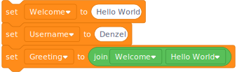

<!-- _paginate: skip -->
<!-- _class: title -->
# Variables


## What are variables

* Places / Names to store values
* Can be Ordinals, Text, List, Objects
* Name is a textual reference
* Calulation is possible

## Ordinals

```python
c = 10
pi = 3.1415
sunUp = True
radius = 10
circumfence = 2*radius*pi
```


## Lists
```python
cats = ["Lion", "Tiger", "Gepard"]
odd = [1,3,5,7,9]
favorites = [13, Black, "Chocolate"]
```
## Text
```python
welcome = "Hello World!"
username = "Denzel"
greeting = welcome + " " + username
```

## Objects
```python
control = widgets.IntSlider(100)
black = (0,0,0)
titanic = pd.read_csv("data/titanic.csv")
```
## Binary
[Binary](https://sethideclercq.com/tools/binaryvisualiser.html)
## Demo & Exercise
### [Scratch Exercise](https://scratch.mit.edu/projects/1086026680/)

* Remix to your account (Login first)
* Add [caffeine quantity](https://www.eufic.org/en/healthy-living/article/caffeine-levels-in-different-foods-and-drinks) for energy <small>(80 mg)</small> and sodas <small>(37 mg)</small>
* Add labels for the icons at each sprite
* Let the wizards hat tell you: 
    * the amount of water drunken <small>(200ml, 250ml, 250ml, 355 ml)</small>
    * the amount of calories <small>(4 kcal, 5 kcal, 105 kcal, 153 kcal)</small>

## Demo & Exercise
### [Python / Jupyter Exercise & Demo](https://mybinder.org/v2/gh/OliverDenzelHFU/Programming/06d20b395168c9750f7cee1e2ab70e477752a42a?urlpath=lab%2Ftree%2F3-Variables%2FVariables.ipynb)

* Add energy drink and sodas, water and calories
* Format as table using `\t` (e.g. Coffee\tTea\tEnergy\Soda)
* Download changed Notebook

# [Demo & Exercise Glot.io](https://glot.io/snippets/h15viox8ry)
* Login and Fork
* Add Input Text to Input box
* Add energy drink and sodas, water and calories
* Format as table using `\t` (e.g. Coffee\tTea\tEnergy\Soda)

## Till next time

[Video](https://www.youtube.com/watch?v=f4KOjWS_KZs)
If you haven't found a topic:
Use Mind Mapping to find a topic:
[English Article](https://www.mindmapping.com/mind-map)
[German Article](https://www.ideenfindung.de/Mind-Mapping-Kreativitätstechnik-Brainstorming-Ideenfindung.html)
