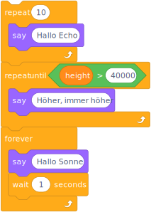

<!-- _paginate: skip -->
<!-- _class: title -->
# Loops & Conditions


## Link


## Overview
> Conditions are executed once at most, loops possibly multiple times.

## Conditions
### Python
```python
if sunUp:
    print ("Hallo Sonne!")
if onEarth:
    print ("Hello World")
else:
    print ("Hello Aliens")
```
## Conditions
### Scratch

## Loops
### Python
```python
for x in range(10):
    print (x)
while (sunUp):
    print ("A day without sunshine, is, you know, night.)
```
## Loops
### Scratch

## Demo Scratch
[Start Demo...](https://scratch.mit.edu/projects/398569407/)
[And Exercise...](https://studio.code.org/s/frozen/lessons/1/levels/4)
## Demo Python
[](https://oliverdenzelhfu.github.io/Programming/lite/notebooks/index.html?path=Loops.ipynb) [](https://mybinder.org/v2/gh/OliverDenzelHFU/Programming/main?urlpath=tree%2F4-Loops%2FLoops.ipynb)


1. Change the latitude and longitude to your position
2. Add a fourth condition => between 12:00 and 13:00 for "Mahlzeit!"
3. Change the Pattern Examples
Create a bigger triangle
Close the triangle at the bottom
Draw a nicer rectangle using unicode
https://en.wikipedia.org/wiki/Box_Drawing_(Unicode_block)

## For Next Time
[Watch Functions video.](https://www.youtube.com/watch?v=9Os0o3wzS_I)