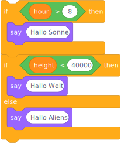

<!-- _paginate: skip -->
<!-- _class: gaia lead -->
# Loops & Conditions
## Intro


# Overview
> Conditions are executed once at most, loops possibly multiple times.

# Conditions
```python
if sunUp:
    print ("Hallo Sonne!")
if onEarth:
    print ("Hello World")
else:
    print ("Hello Aliens")
```
