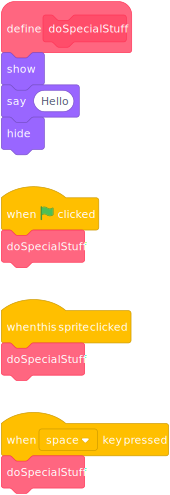

<!-- _paginate: skip -->
<!-- _class: title -->
# Methods


## Link


## What is it?
> A method is a callable unit of software logic. It has an identifier, potentially parameters and possibly a return value.

## Methods
### Scratch


## Methods
### Python
```python
def fac(x):
    # Faculty for 0 is defined as 1
    if (x == 0):
        return 1
    else:
    # Faculty for x is x*fac(x-1)
        return fac(x-1)*x

fac(5)
```
## Scratch
[Sierpinski](https://scratch.mit.edu/projects/24584643/editor)
[Recursion Tree](https://scratch.mit.edu/projects/10240446/editor)

## Exercise
Calculator for factorial
1. Input of a number
2. Calculate factorial in method (recursivly)
3. Output result

[Factorial?](https://www.youtube.com/watch?v=wfkIiVJ-O50)

## Python / Jupyter
[Example & Exercise](https://mybinder.org/v2/gh/OliverDenzelHFU/Programming/main?filepath=5-Methods%2FMethods.ipynb)

Exercise
1. test functions abs, ascii, hex, min, max, round. (Add at point Function call with parameters)
2. Make a binder of the notebook

## For next time
[Watch](https://www.youtube.com/watch?v=ohCDWZgNIU0)

Either
a) Try different higher factorials
b) Which is the highest factorial?