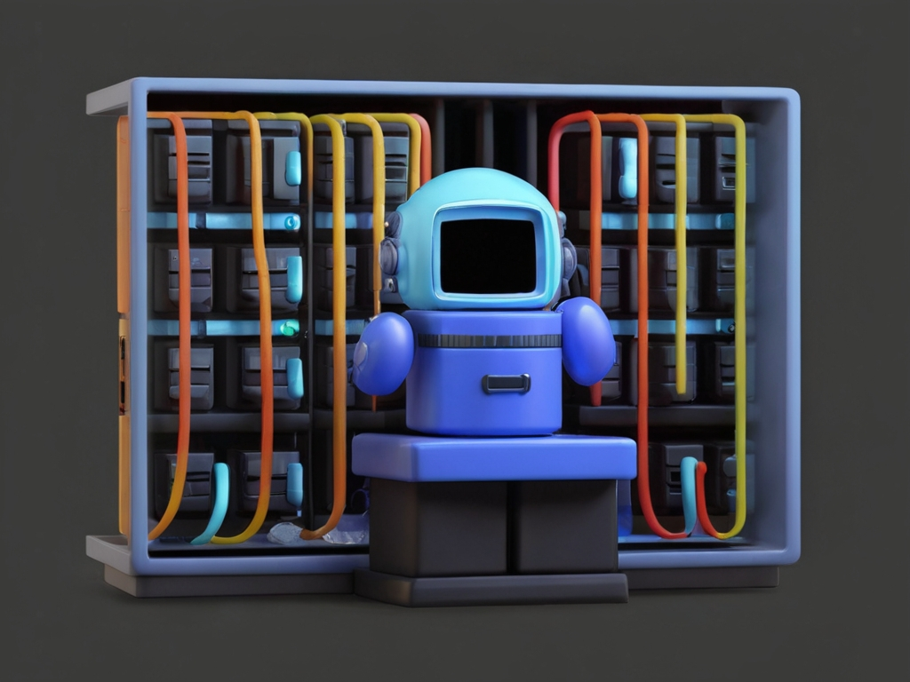

<!-- _paginate: skip -->
<!-- _class: gaia lead -->
# Methods
## Intro

# Grades
3 Parts for the whole group
You demonstrate your understanding of all topics of the lecture.
All parts should have the same topic, but don't have to be identical.

# Documentation
5-10 pages (3 people)
10-30 pages (6 people)
No formal requirements
PDF Format

# Programs
## Scratch
Focus on design and fun
## Python
Focus on technical aspects
