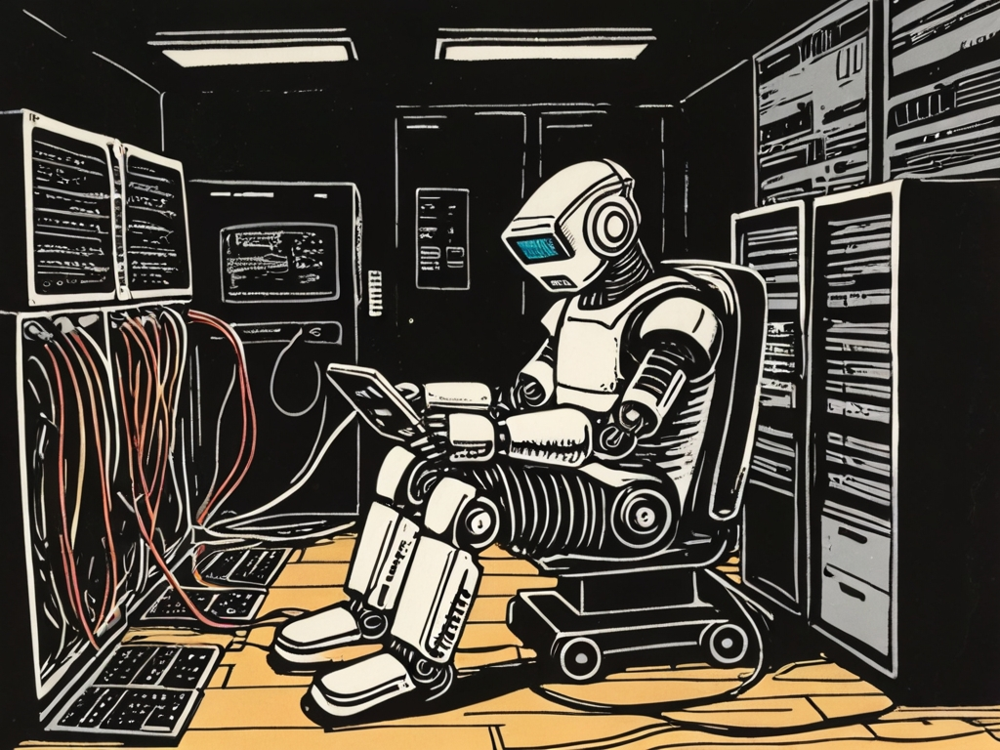

<!-- _paginate: skip -->
<!-- _class: gaia lead -->
# Introduction

# Why?

* Thinking like a programmer
* Own developing experience
* Writing **small** programs
* Have fun!
* A lot of interaction

# Why?
* Logical thinking
* Foreign Language
* Digital Know How
* Implement your ideas

# Why?
[Computer Science is changing everything](https://youtu.be/xJqSu1IbcHg?list=PLzdnOPI1iJNfpD8i4Sx7U0y2MccnrNZuP)

# Why?
 
[Source](https://www.bitkom.org/sites/main/files/2023-12/231213bitkom-chartsit-fachkraeftefinal.pdf)

# Why?
 
[Source](https://www.bitkom.org/Presse/Presseinformation/Smart-City-Index-2024#_)

# Why?
< 8 von 10 Startups wollen neue Mitarbeiterinnen und Mitarbeiter einstellen.
[Source](https://www.bitkom.org/print/pdf/node/21708)

# How?
| Goals | Anti Patterns |
| --- | --- |
| + Consistent team Size | - Only one of the team works |
| + Pair Programming | - Devastating Critics |
| + Problem Solving | - Too Much Procrastination |

# How?
## Pair Programming
* One keyboard, two programmers

* Driver enters code
* Driver cares about the details

* Navigator is responsible for the big picture

* Constant change of roles (5-10 minutes)

# 

# Evalution with three parts
1) Project documentation
1) Python Program
1) Scratch Program

# How?
* Teams of 6 students
* Each team all 3 parts
* Communication via MS Teams
* Submission via Mail and MS Teams

# 
[Create with computer science](https://youtu.be/lud4bU3YY9U?list=PLzdnOPI1iJNfpD8i4Sx7U0y2MccnrNZuP)

# Megatrends
> Sie sind die größten Treiber des Wandels in **Wirtschaft und Gesellschaft** und prägen unsere Zukunft – nicht nur kurzfristig, sondern auf mittlere bis lange Sicht. Megatrends entfalten ihre Dynamik über Jahrzehnte.

[Source](https://www.zukunftsinstitut.de/zukunftsthemen/die-megatrend-map)

#
<!-- _footer: "" -->

[Source](https://www.zukunftsinstitut.de/hubfs/Megatrend-Map_2021-1.png)

# And... Action!

Form a team.

Choose one of the two Mega Trends: 
* [Neo-Ökologie](https://www.zukunftsinstitut.de/zukunftsthemen/megatrend-neo-oekologie) 
* [Wissenskultur](https://www.zukunftsinstitut.de/zukunftsthemen/megatrend-wissenskultur)

Read the corresponding article.

Then choose one of the subtrends (e.g. Lifelong Learning)